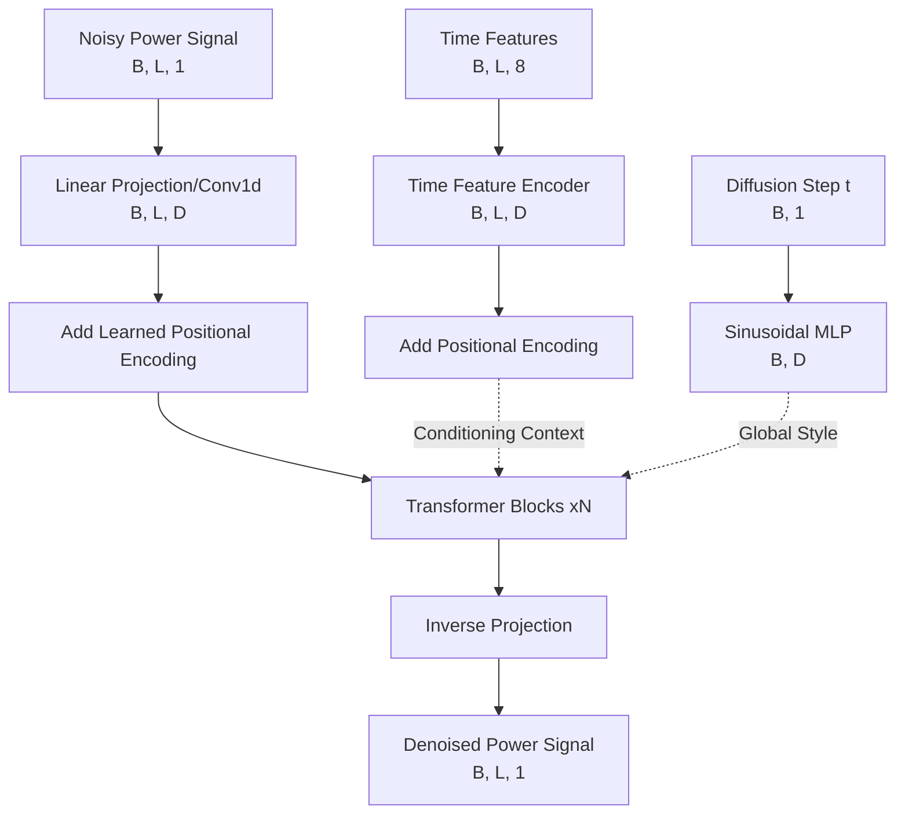

# Model Architecture & Data Pipeline: Decoupled Cross-Guidance

This document illustrates the data flow pipeline for the high-performance Diffusion Transformer architecture designed for NILM.

---

## 1. High-Level Data Flow (Pipeline)

This diagram shows how individual data streams are processed independently before converging inside the Transformer backbone.



---

## 2. Detailed View: Inside the Transformer Block

Based on Method B (Decoupled Implementation), each block doesn't just "mix" data; it uses Time as an anchor to modulate the Power signal.

### The Block Logic ($Q, K, V$ Mapping)
In the **Cross-Attention** stage:
- **Query ($Q$)**: Comes from the **Power Signal**. It represents: *"I am a noisy wave at step T, what should my value be?"*
- **Key ($K$) & Value ($V$)**: Come from the **Time Features**. They represent: *"I am the physics of Monday at 8:00 AM. Here is my context."*

```mermaid
subgraph "Transformer Block (Single Layer)"
    Direction LR
    X_In[Input Power Hidden State] --> LN1[AdaLayerNorm <br/> modulated by Step t]
    
    %% Self Attention
    LN1 --> Self_Attn[Self-Attention<br/>Q,K,V = Power Stage]
    Self_Attn --> Add1[Residual Add]
    
    %% Cross Attention (THE CORE IMPROVEMENT)
    Add1 --> LN2[AdaLayerNorm/LayerNorm]
    LN2 --> Cross_Attn[Agent Cross-Attention]
    
    %% QKV for Cross
    Add1 -.-> |Q| Cross_Attn
    Time_Context[Time Encoder Output] -.-> |K, V| Cross_Attn
    
    Cross_Attn --> Add2[Residual Add]
    
    %% MLP
    Add2 --> FF[Feed-Forward MLP]
    FF --> Add3[Residual Add]
    Add3 --> X_Out[Output to Next Block]
end
```

---

## 3. Mathematical Interaction Summary

1.  **Feature Decoupling**: 
    $Z_{power} \in \mathbb{R}^{B \times L \times D}$ and $Z_{time} \in \mathbb{R}^{B \times L \times D}$ are processed in separate latent spaces.
2.  **Attention Mechanism**:
    $$\text{Attention}(Q, K, V) = \text{Softmax}\left(\frac{Q_{power} K_{time}^\top}{\sqrt{d_k}}\right) V_{time}$$
    *   This forces the **Magnitude** of the power signal to be a function of the **Temporal Context**.
3.  **Global Modulation (AdaLN)**:
    $$x_{mod} = \text{LayerNorm}(x) \cdot (1 + \text{Scale}(t)) + \text{Shift}(t)$$
    *   The "Style" of the denoising (coarse vs. fine-grained) is controlled by the Diffusion Timestep.

---

## 4. Why this is the "Gold Standard" for NILMformer
- **Zero Leakage**: Time data is deterministic. By keeping it as $K, V$, we ensure the model never "guesses" the time; it only uses time to "refine" the power.
- **Waveform Integrity**: The Self-Attention part focuses on the shape of the fridge/kettle pulse, while the Cross-Attention ensures that pulse is anchored to the correct $50Hz$ harmonics or time-of-use slot.

---

### 中文核心摘要 (Abstract in Mandarin)
1. **输入分离**：功率（含噪）与时间（确定性）不再粗暴拼接，而是分别进入独立的 Embedding 通道。
2. **QKV 映射重构**：在 Transformer 内部，**功率信号作为 Query**，去**时间特征形成的 Key/Value** 中通过注意力机制提取背景信息。
3. **架构优势**：这种“解耦-引导”架构让模型在生成的每一层都能不断对齐时间轴，从根本上解决“开机时间点不准”的逻辑痛点，生成的合成数据具备极高的物理逻辑性。
