```mermaid
flowchart TB
    %% ========== 入口层 ==========
    START["🚀 启动命令<br/>python main.py --config Config/microwave.yaml --train/--sample"]
    
    subgraph MAIN ["📄 main.py - 项目入口"]
        M1["parse_args()<br/>解析命令行参数"]
        M2["load_config(yaml_path)<br/>读取 YAML 配置"]
        M3["get_dataloader(cfg)<br/>创建数据加载器"]
        M4["实例化 Trainer(cfg)<br/>初始化训练/采样控制器"]
        M1 --> M2 --> M3 --> M4
    end
    
    START --> MAIN
    
    %% ========== 数据预处理层 ==========
    subgraph DATASET ["🟦 Utils/Data_utils/real_datasets.py - 数据预处理"]
        direction TB
        
        D1["load_csv(path)<br/>↓<br/>np.loadtxt(delimiter=',', skiprows=1)<br/>输出: (N, 9)"]
        D2["minmax_scaler(data)<br/>↓<br/>(x - min) / (max - min + 1e-7)<br/>输出: scaled(N,9), min(1,9), max(1,9)"]
        D3["create_windows(arr, 512, 'non_overlapping')<br/>↓<br/>每 512 行切一个窗口<br/>输出: (W, 512, 9)"]
        D4["NILMDataset(windows)<br/>↓<br/>torch.from_numpy().float()<br/>输出: PyTorch Dataset"]
        D5["DataLoader(dataset, batch_size=64)<br/>↓<br/>输出 batch: (B, L, 9)"]
        
        D1 --> D2 --> D3 --> D4 --> D5
    end
    
    MAIN --> DATASET
    
    %% ========== 分支: 训练 vs 采样 ==========
    DATASET --> BRANCH{检查模式}
    BRANCH -->|--train| TRAIN_PATH["进入训练流程 ↓"]
    BRANCH -->|--sample| SAMPLE_PATH["进入采样流程 ↓"]
    
    %% ========================================================
    %% 训练流程
    %% ========================================================
    subgraph TRAINING ["🟨 训练流程全流程 (engine/solver.py + Models/)"]
        direction TB
        
        T0["Trainer.train(train_loader, test_loader)"]
        T1["从 DataLoader 获取 batch<br/>shape: (B, L, 9) = (64, 512, 9)"]
        T2["随机采样 diffusion step<br/>t ~ Uniform(0, T-1)<br/>t: (B,) = (64,)"]
        
        subgraph SOLVER_TRAIN ["solver.py - 训练控制"]
            T3["提取条件向量<br/>c = batch[..., 1:].mean(dim=1)<br/>输入: (B, L, 8)<br/>输出: (B, 8)"]
            T4["加噪: q_sample(batch, t)<br/>调用 ↓ gaussian_diffusion.py"]
        end
        
        %% 加噪过程
        subgraph QSAMPLE ["gaussian_diffusion.py - q_sample()"]
            Q1["生成随机噪声<br/>noise = torch.randn_like(x_start)<br/>shape: (B, L, 9)"]
            Q2["提取扩散系数<br/>√α̅_t = extract(sqrt_alphas_cumprod, t, x_start.shape)"]
            Q3["提取噪声系数<br/>√(1-α̅_t) = extract(sqrt_one_minus_alphas_cumprod, t)"]
            Q4["加噪公式<br/>x_t = √α̅_t · x_start + √(1-α̅_t) · noise<br/>输出: x_t (B, L, 9)"]
            Q1 --> Q2 --> Q3 --> Q4
        end
        
        T4 --> QSAMPLE
        
        QSAMPLE --> T5["得到 x_t (B, L, 9) 和 noise (B, L, 9)"]
        
        %% 模型前向
        T5 --> T6["调用 Diffusion.forward(x_t, condition=c)"]
        
        subgraph DIFF_FORWARD ["gaussian_diffusion.py - Diffusion.forward()"]
            DF1["输入:<br/>• x: (B, L, 9) - 带噪序列<br/>• condition: (B, 8) - 时间条件"]
            DF2["随机采样时间步<br/>t = torch.randint(0, self.num_timesteps, (B,))"]
            DF3["提取噪声<br/>noise = torch.randn_like(x)"]
            DF4["加噪<br/>x_noisy = self.q_sample(x, t, noise)"]
            DF5["调用核心模型<br/>predicted_noise = self.denoise_fn.forward(x_noisy, t, condition)"]
            
            DF1 --> DF2 --> DF3 --> DF4 --> DF5
        end
        
        T6 --> DIFF_FORWARD
        
        %% DiT 模型前向
        DIFF_FORWARD --> T7["self.denoise_fn = Transformer (agent_transformer.py)"]
        
        subgraph DIT_TRAIN ["agent_transformer.py - Transformer.forward()"]
            direction TB
            
            DIT_IN["输入:<br/>• x: (B, L, 9)<br/>• time: (B,)<br/>• cond: (B, 8)"]
            
            %% 时间步嵌入
            subgraph TIME_EMB ["model_utils.py - SinusoidalPosEmb"]
                TE1["t (B,) → Sinusoidal 编码"]
                TE2["half_dim = hidden_dim // 2"]
                TE3["emb = [sin(t·ω), cos(t·ω)]"]
                TE4["MLP: Linear → SiLU → Linear"]
                TE5["输出: time_emb (B, hidden_dim)"]
                TE1 --> TE2 --> TE3 --> TE4 --> TE5
            end
            
            %% 条件嵌入
            COND_EMB["条件投影<br/>cond_emb = Linear(8 → hidden_dim)(cond)<br/>输出: (B, hidden_dim)"]
            
            %% 融合
            MERGE["融合条件<br/>cond_total = time_emb + cond_emb<br/>shape: (B, hidden_dim)"]
            
            %% 输入投影
            PROJ["输入投影<br/>x = Linear(9 → hidden_dim)(x)<br/>输出: (B, L, hidden_dim)"]
            
            DIT_IN --> TIME_EMB
            DIT_IN --> COND_EMB
            TIME_EMB --> MERGE
            COND_EMB --> MERGE
            DIT_IN --> PROJ
            
            %% DiT Block循环
            MERGE --> BLOCK_LOOP
            PROJ --> BLOCK_LOOP
            BLOCK_LOOP["对每个 DiT Block (i=1...num_layers):"]
            
            %% 单个 DiT Block
            subgraph DITBLOCK ["DiTBlock (agent_transformer.py)"]
                direction TB
                
                BLK_IN["输入: x(B,L,hidden_dim), cond(B,hidden_dim)"]
                
                %% Modulation Network
                subgraph MODULATION ["AdaLN-Zero Modulation Network"]
                    MOD1["cond → SiLU()"]
                    MOD2["Linear(hidden_dim → 6×hidden_dim)<br/>⚠️ Zero-Init 权重"]
                    MOD3["Split 成 6 份:<br/>shift_msa, scale_msa, gate_msa<br/>shift_mlp, scale_mlp, gate_mlp<br/>每份: (B, hidden_dim)"]
                    MOD1 --> MOD2 --> MOD3
                end
                
                %% MSA 路径
                subgraph MSA ["路径1: Multi-Head Self-Attention"]
                    MSA1["LayerNorm(x, affine=False)<br/>x_norm = (x - μ) / σ"]
                    MSA2["AdaLN 调制<br/>x_mod = x_norm · (1 + scale_msa.unsqueeze(1))<br/>       + shift_msa.unsqueeze(1)"]
                    MSA3["Multi-Head Attention<br/>attn_out = Attention(x_mod, x_mod, x_mod)<br/>num_heads=8"]
                    MSA4["Gate 控制<br/>gated = gate_msa.unsqueeze(1) · attn_out"]
                    MSA5["Residual<br/>x = x + gated"]
                    MSA1 --> MSA2 --> MSA3 --> MSA4 --> MSA5
                end
                
                %% MLP 路径
                subgraph MLP ["路径2: Feed-Forward MLP"]
                    MLP1["LayerNorm(x, affine=False)"]
                    MLP2["AdaLN 调制<br/>x_mod = x_norm · (1 + scale_mlp.unsqueeze(1))<br/>       + shift_mlp.unsqueeze(1)"]
                    MLP3["FFN<br/>Linear(hidden_dim → hidden_dim×4)<br/>→ GELU<br/>→ Linear(hidden_dim×4 → hidden_dim)"]
                    MLP4["Gate 控制<br/>gated = gate_mlp.unsqueeze(1) · mlp_out"]
                    MLP5["Residual<br/>x = x + gated"]
                    MLP1 --> MLP2 --> MLP3 --> MLP4 --> MLP5
                end
                
                BLK_IN --> MODULATION
                BLK_IN --> MSA
                MSA --> MLP
                MODULATION -.->|提供调制参数| MSA2
                MODULATION -.->|提供调制参数| MSA4
                MODULATION -.->|提供调制参数| MLP2
                MODULATION -.->|提供调制参数| MLP4
                
                MLP --> BLK_OUT["输出: x (B, L, hidden_dim)"]
            end
            
            BLOCK_LOOP --> DITBLOCK
            DITBLOCK --> NEXT{还有下一个Block?}
            NEXT -->|是| DITBLOCK
            NEXT -->|否| FINAL
            
            %% 最终输出
            subgraph FINAL ["最终输出层"]
                FIN1["Final LayerNorm(x)"]
                FIN2["Output Projection<br/>Linear(hidden_dim → 9)"]
                FIN3["输出: predicted_noise (B, L, 9)"]
                FIN1 --> FIN2 --> FIN3
            end
        end
        
        T7 --> DIT_TRAIN
        
        DIT_TRAIN --> T8["返回 predicted_noise (B, L, 9)"]
        
        %% Loss 计算
        T8 --> T9["计算 Loss<br/>loss_fn = MSE / Huber<br/>loss = ((predicted_noise - noise)²).mean()"]
        T9 --> T10["反向传播<br/>loss.backward()"]
        T10 --> T11["optimizer.step()<br/>更新模型参数"]
        T11 --> T12["每 log_interval 打印 loss<br/>每 save_interval 保存 checkpoint"]
        
        T0 --> T1 --> T2 --> SOLVER_TRAIN --> T5 --> T6 --> T8 --> T9
    end
    
    TRAIN_PATH --> TRAINING
    
    %% ========================================================
    %% 采样流程
    %% ========================================================
    subgraph SAMPLING ["🟩 采样流程全流程 (engine/solver.py + Models/)"]
        direction TB
        
        S0["Trainer.sample(sample_num=N)"]
        S1["初始化纯噪声<br/>x = torch.randn(N, L, 9)<br/>x_T ~ N(0, I)"]
        S2["构造目标时间条件<br/>c = build_condition(target_time)<br/>将 '2022-01-01 12:00' 转为 8维 sin/cos<br/>c: (N, 8)"]
        
        S3["开始逆扩散循环<br/>for t in range(T-1, -1, -1):"]
        
        subgraph DENOISE_LOOP ["逆扩散循环 (T-1 → 0)"]
            direction TB
            
            DL1["当前步数: t<br/>t_tensor = torch.full((N,), t)"]
            DL2["调用模型预测噪声<br/>predicted_noise = Diffusion.p_sample(x_t, t, c)"]
            
            %% p_sample 详细
            subgraph PSAMPLE ["gaussian_diffusion.py - p_sample()"]
                PS1["调用 model_predictions(x_t, t)<br/>↓<br/>Transformer.forward(x_t, t, c)<br/>返回 predicted_noise (N, L, 9)"]
                PS2["预测 x_0<br/>x_start = predict_start_from_noise(x_t, t, noise)<br/>公式: x_0 = (x_t - √(1-α̅_t)·ε) / √α̅_t"]
                PS3["计算后验均值和方差<br/>μ_t, σ_t = q_posterior(x_start, x_t, t)"]
                PS4["采样下一步<br/>if t > 0:<br/>  noise = torch.randn_like(x_t)<br/>  x_{t-1} = μ_t + σ_t · noise<br/>else:<br/>  x_{t-1} = μ_t"]
                
                PS1 --> PS2 --> PS3 --> PS4
            end
            
            DL2 --> PSAMPLE
            PSAMPLE --> DL3["更新 x ← x_{t-1}<br/>shape: (N, L, 9)"]
            DL3 --> DL4{t > 0?}
            DL4 -->|是| DL1
            DL4 -->|否| DL5["循环结束<br/>得到 x_0 (N, L, 9)"]
            
            DL1 --> DL2
        end
        
        S3 --> DENOISE_LOOP
        
        DENOISE_LOOP --> S4["反归一化<br/>加载 min_val, max_val from checkpoint<br/>x_real = x_0 · (max - min) + min<br/>输出: (N, L, 9) - 真实功率值"]
        S4 --> S5["保存为 .npy 文件<br/>for i in range(N):<br/>  np.save(f'sample_{i}.npy', x_real[i].cpu().numpy())"]
        S5 --> S6["✅ 采样完成<br/>生成了 N 个合成窗口"]
        
        S0 --> S1 --> S2 --> S3 --> S4
    end
    
    SAMPLE_PATH --> SAMPLING
    
    %% ========== 样式 ==========
    style START fill:#ff6b6b
    style MAIN fill:#ffe4b5,stroke:#ff8c00,stroke-width:3px
    style DATASET fill:#e6f3ff,stroke:#0066cc,stroke-width:3px
    style TRAINING fill:#fff9e6,stroke:#ccaa00,stroke-width:3px
    style SAMPLING fill:#e6ffe6,stroke:#00aa00,stroke-width:3px
    style DITBLOCK fill:#f3e5f5,stroke:#9c27b0,stroke-width:3px
    style MODULATION fill:#ede7f6,stroke:#673ab7,stroke-width:2px
    style MSA fill:#e8eaf6,stroke:#3f51b5,stroke-width:2px
    style MLP fill:#e8eaf6,stroke:#3f51b5,stroke-width:2px
    style PSAMPLE fill:#c8e6c9,stroke:#388e3c,stroke-width:2px
```

# DiffusionModel_NILM 超详细完整流程（训练+采样全流程）

## 📚  目录结构与文件索引

```
DiffusionModel_NILM/
├── main.py                          # 项目入口
├── engine/
│   └── solver.py                    # 训练/采样控制器
├── Models/
│   └── diffusion/
│       ├── gaussian_diffusion.py    # Diffusion 包装类
│       ├── agent_transformer.py     # DiT Transformer 主模型
│       └── model_utils.py           # 工具函数(位置编码/AdaLN等)
└── Utils/
    └── Data_utils/
        └── real_datasets.py         # 数据预处理
```

---



---

## 📊 超详细数据格式对照表

### 预处理阶段 (real_datasets.py)

| 步骤 | 函数 | 输入 | 输出 | Shape |
|------|------|------|------|-------|
| 1 | `load_csv` | CSV 文件路径 | `np.ndarray` | (N, 9) |
| 2 | `minmax_scaler` | (N, 9) | `scaled, min, max` | (N,9), (1,9), (1,9) |
| 3 | `create_windows` | (N, 9) | `windows` | (W, 512, 9) |
| 4 | `NILMDataset` | (W, 512, 9) | `torch.Tensor` | (W, 512, 9) |
| 5 | `DataLoader` | Dataset | `batch` | (64, 512, 9) |

### 训练阶段 (solver.py + Models/)

| 步骤 | 文件 | 函数/类 | 输入 | 输出 | Shape |
|------|------|---------|------|------|-------|
| 1 | `solver.py` | 提取条件 | `batch` | `c` | (B, 8) |
| 2 | `solver.py` | 随机步数 | `B` | `t` | (B,) |
| 3 | `gaussian_diffusion.py` | `q_sample` | `x_start, t` | `x_t, noise` | (B,L,9), (B,L,9) |
| 4 | `model_utils.py` | `SinusoidalPosEmb` | `t (B,)` | `time_emb` | (B, hidden_dim) |
| 5 | `agent_transformer.py` | `Linear` | `c (B,8)` | `cond_emb` | (B, hidden_dim) |
| 6 | `agent_transformer.py` | 融合 | `time_emb + cond_emb` | `cond_total` | (B, hidden_dim) |
| 7 | `agent_transformer.py` | `Linear` | `x (B,L,9)` | `x_proj` | (B, L, hidden_dim) |
| 8 | `agent_transformer.py` | `DiTBlock` | `x, cond` | `x` | (B, L, hidden_dim) |
| 9 | `agent_transformer.py` | Modulation | `cond` | `6 份参数` | 每份 (B, hidden_dim) |
| 10 | `agent_transformer.py` | LayerNorm | `x` | `x_norm` | (B, L, hidden_dim) |
| 11 | `agent_transformer.py` | AdaLN | `x_norm, scale, shift` | `x_mod` | (B, L, hidden_dim) |
| 12 | `agent_transformer.py` | Attention | `x_mod` | `attn_out` | (B, L, hidden_dim) |
| 13 | `agent_transformer.py` | Gate+Res | `x + gate·attn_out` | `x` | (B, L, hidden_dim) |
| 14 | `agent_transformer.py` | Output | `x` | `predicted_noise` | (B, L, 9) |
| 15 | `solver.py` | MSE Loss | `pred, noise` | `loss` | scalar |

### 采样阶段 (solver.py + Models/)

| 步骤 | 文件 | 函数 | 输入 | 输出 | Shape |
|------|------|------|------|------|-------|
| 1 | `solver.py` | `torch.randn` | `(N, L, 9)` | `x_T` | (N, 512, 9) |
| 2 | `solver.py` | `build_condition` | `target_time` | `c` | (N, 8) |
| 3 | `gaussian_diffusion.py` | `p_sample` | `x_t, t, c` | `x_{t-1}` | (N, L, 9) |
| 4 | `agent_transformer.py` | `forward` | `x_t, t, c` | `pred_noise` | (N, L, 9) |
| 5 | `gaussian_diffusion.py` | `predict_start_from_noise` | `x_t, t, noise` | `x_0_pred` | (N, L, 9) |
| 6 | `gaussian_diffusion.py` | `q_posterior` | `x_0, x_t, t` | `μ_t, σ_t` | (N,L,9), (N,L,9) |
| 7 | `solver.py` | 反归一化 | `x_0, min, max` | `x_real` | (N, L, 9) |
| 8 | `solver.py` | `np.save` | `x_real[i]` | `sample_i.npy` | (512, 9) |

---

## 🔑 关键公式说明

### 1. 扩散前向过程 (加噪)
```
q(x_t | x_0) = N(x_t; √α̅_t · x_0, (1 - α̅_t) · I)

实现:
x_t = √α̅_t · x_0 + √(1-α̅_t) · ε,  ε ~ N(0, I)
```
**代码位置**: `gaussian_diffusion.py` → `q_sample()`

### 2. 逆扩散过程 (去噪)
```
p_θ(x_{t-1} | x_t) = N(x_{t-1}; μ_θ(x_t, t), Σ_θ(x_t, t))

其中:
x_0_pred = (x_t - √(1-α̅_t) · ε_θ(x_t, t)) / √α̅_t
μ_t = (1/√α_t) · (x_t - (β_t/√(1-α̅_t)) · ε_θ)
σ_t = √β_t
```
**代码位置**: `gaussian_diffusion.py` → `p_sample()`, `predict_start_from_noise()`

### 3. AdaLN-Zero 调制
```
AdaLN(x, c) = LayerNorm(x) · (1 + scale(c)) + shift(c)

其中:
scale(c), shift(c), gate(c) = MLP(c).split(3)
输出 = x + gate(c) · Transformation(AdaLN(x, c))
```
**代码位置**: `agent_transformer.py` → `DiTBlock`

### 4. 训练损失函数
```
L = E_{x_0, ε, t} [ ||ε - ε_θ(x_t, t, c)||²]

其中:
ε_θ 是模型预测的噪声
ε 是真实添加的噪声
```
**代码位置**: `gaussian_diffusion.py` → `_train_loss()`

---

## 🎯 AdaLN-Zero 的 4 个关键作用点

| 位置 | 作用 | 输入 | 输出 |
|------|------|------|------|
| **1. Modulation Network** | 生成调制参数 | `cond (B, hidden_dim)` | `6 个参数，每个 (B, hidden_dim)` |
| **2. MSA 前的 Scale & Shift** | 调制归一化特征 | `x_norm, scale, shift` | `x_mod (B, L, hidden_dim)` |
| **3. MSA 后的 Gate** | 控制注意力流 | `attn_out, gate` | `gated_attn` |
| **4. MLP 路径** | 同上，应用于 FFN | `mlp_out, gate` | `gated_mlp` |

### 为什么要 Zero-Init？

```python
# 在 agent_transformer.py 的 __init__ 中
nn.init.zeros_(self.modulation[-1].weight)
nn.init.zeros_(self.modulation[-1].bias)
```

**原因**：
1. 初始时 `scale=0, shift=0, gate=0`
2. AdaLN 退化为普通 LayerNorm + Residual
3. 模型训练稳定，不受未训练的条件干扰
4. 随训练进行，模型逐渐学会使用条件信息

---

## 🚀 如何使用

1. **在 VSCode 中打开** `detailed_flow.md`
2. **安装 Mermaid Viewer 扩展**
3. **点击预览图标** 或 `Ctrl+Shift+P` → "Mermaid Viewer: Open Preview"
4. **导出图片**: 在预览窗口工具栏选择 SVG/PNG/JPG

### 主题建议
- 推荐使用 **dark** 或 **forest** 主题查看
- 可勾选 "Sync with VSCode theme" 自动匹配

---

## 📝 小结

这个流程图包含了：
- ✅ **完整的训练流程** (从 CSV → 模型 → Loss)
- ✅ **完整的采样流程** (从噪声 → 去噪 → 保存)
- ✅ **所有 Models/ 目录下的模块** (gaussian_diffusion, agent_transformer, model_utils)
- ✅ **每一步的数据 Shape 标注**
- ✅ **AdaLN-Zero 的详细实现**
- ✅ **关键公式和代码位置对照**

现在你可以清楚地看到：
- 数据在每个模块中如何流动
- 每个张量的维度如何变化
- AdaLN-Zero 在哪里起作用
- 训练和采样的完整区别
