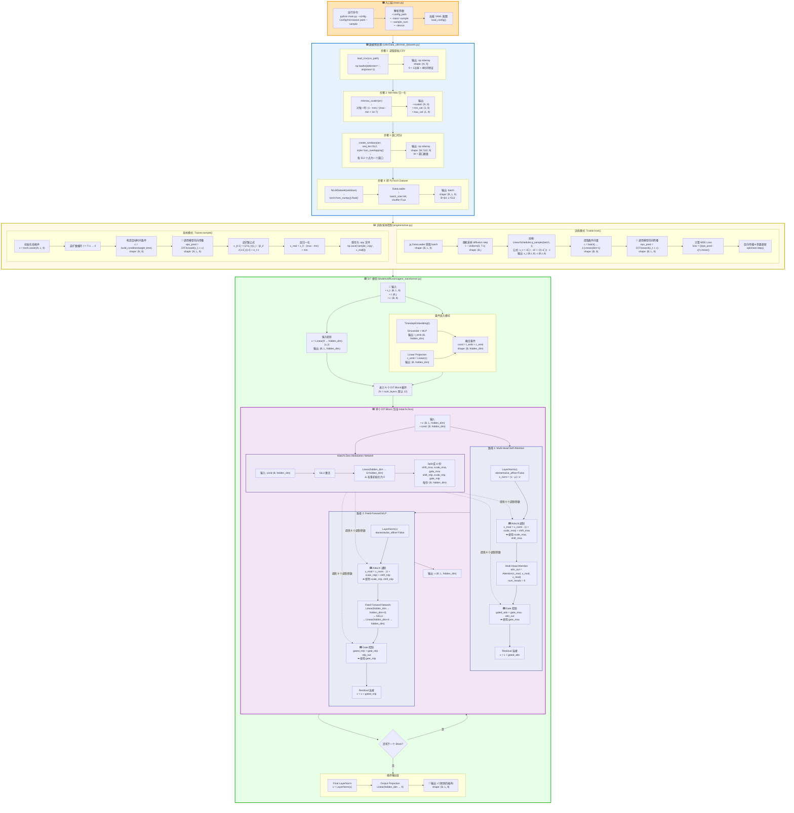

# DiffusionModel_NILM 完整数据流程图（超详细版）

## 📚 完整模块索引

### Models 目录结构
```
Models/
├── diffusion/
│   ├── agent_transformer.py    ← DiT 主模型 (Transformer骨干)
│   ├── gaussian_diffusion.py   ← Diffusion 包装器 (加噪/去噪逻辑)
│   └── model_utils.py          ← 工具函数 (位置编码, AdaLN等)
└── ts2vec/                     ← (未使用在此流程)
```

### 文件功能说明
| 文件 | 作用 | 关键类/函数 |
|------|------|------------|
| `agent_transformer.py` | DiT 核心 | `Transformer`, `DiTBlock`, AdaLN-Zero |
| `gaussian_diffusion.py` | 扩散包装器 | `Diffusion.forward`, `q_sample`, `p_sample` |
| `model_utils.py` | 工具组件 | `SinusoidalPosEmb`, `AdaLayerNorm`, `extract` |
| `real_datasets.py` | 数据预处理 | `load_csv`, `minmax_scaler`, `create_windows` |
| `solver.py` | 训练/采样控制 | `Trainer.train`, `Trainer.sample` |
| `main.py` | 项目入口 | `parse_args`, `load_config` |

---

## 图例说明

- 🟦 **蓝色框**：数据预处理 (`real_datasets.py`)
- 🟩 **绿色框**：模型前向传播 (`agent_transformer.py`)
- 🟨 **黄色框**：训练/采样控制 (`solver.py`)
- 🟪 **紫色框**：AdaLN-Zero 机制
- 🟧 **橙色框**：入口/配置 (`main.py`)

---



---

## 📋 详细文件功能说明

### 1️⃣ **main.py** (橙色框)
- **作用**：项目总入口
- **关键函数**：
  - `parse_args()`: 解析命令行参数
  - `load_config()`: 读取 YAML 配置
  - `get_dataloader()`: 创建数据加载器
  - `Trainer()`: 实例化训练器

### 2️⃣ **Utils/Data_utils/real_datasets.py** (蓝色框)
- **作用**：数据预处理管道
- **关键函数**：
  - `load_csv()`: 读取原始 CSV（N行×9列）
  - `minmax_scaler()`: Min-Max 归一化，返回 `scaled, min_val, max_val`
  - `create_windows()`: 按 `seq_len=512` 切分窗口
  - `NILMDataset`: PyTorch Dataset 封装
  - `DataLoader`: 批量读取，shape `(B, L, 9)`

### 3️⃣ **engine/solver.py** (黄色框)
- **作用**：训练/采样主循环
- **训练模式 (`Trainer.train`)**：
  - 随机采样 diffusion step `t`
  - 加噪：`q_sample(x0, t)` → 得到 `x_t` 和真实噪声 `ε`
  - 提取条件：`c = batch[..., 1:].mean(dim=1)`
  - 调用模型：`eps_pred = DiT.forward(x_t, t, c)`
  - 计算 Loss：`MSE(eps_pred, ε)`
  - 反向传播：`optimizer.step()`
  
- **采样模式 (`Trainer.sample`)**：
  - 初始化噪声：`x_T ~ N(0, I)`
  - 逆扩散循环：`t = T-1 → 0`
  - 构造条件：`build_condition(target_time)`
  - 逐步去噪：使用逆扩散公式
  - 反归一化：恢复真实功率
  - 保存：`.npy` 文件

### 4️⃣ **Models/diffusion/agent_transformer.py** (绿色框)
- **作用**：DiT 模型核心实现
- **主要组件**：

#### A. 条件嵌入模块
```python
class TimestepEmbedding:
    # 将离散 step → 连续向量
    # Input: t (B,)
    # Output: t_emb (B, hidden_dim)
```

#### B. 输入投影
```python
self.input_proj = nn.Linear(9, hidden_dim)
# Input: (B, L, 9)
# Output: (B, L, hidden_dim)
```

#### C. DiT Block（🟪 AdaLN-Zero 核心）
```python
class DiTBlock:
    def __init__(self):
        # Modulation Network (AdaLN-Zero)
        self.modulation = nn.Sequential(
            nn.SiLU(),
            nn.Linear(hidden_dim, 6*hidden_dim, bias=True)
        )
        # ⚠️ 最后一层权重初始化为 0
        
        # LayerNorm (无可学习参数)
        self.norm1 = nn.LayerNorm(hidden_dim, elementwise_affine=False)
        self.norm2 = nn.LayerNorm(hidden_dim, elementwise_affine=False)
        
        # Multi-Head Attention
        self.attn = nn.MultiheadAttention(hidden_dim, num_heads=8)
        
        # Feed-Forward MLP
        self.mlp = ...
    
    def forward(self, x, cond):
        # 1️⃣ 生成 6 个调制参数
        mod = self.modulation(cond).chunk(6, dim=-1)
        shift_msa, scale_msa, gate_msa, shift_mlp, scale_mlp, gate_mlp = mod
        
        # 2️⃣ 第一路径：AdaLN + Attention
        x_norm = self.norm1(x)
        x_mod = x_norm * (1 + scale_msa) + shift_msa  # 🟪 AdaLN 调制
        attn_out = self.attn(x_mod, x_mod, x_mod)
        x = x + gate_msa * attn_out  # 🟪 Gate 控制
        
        # 3️⃣ 第二路径：AdaLN + MLP
        x_norm = self.norm2(x)
        x_mod = x_norm * (1 + scale_mlp) + shift_mlp  # 🟪 AdaLN 调制
        mlp_out = self.mlp(x_mod)
        x = x + gate_mlp * mlp_out  # 🟪 Gate 控制
        
        return x
```

#### D. 最终输出层
```python
self.final_norm = nn.LayerNorm(hidden_dim)
self.out_proj = nn.Linear(hidden_dim, 9)
# Output: ε̂ (预测的噪声) shape (B, L, 9)
```

---

## 🎯 AdaLN-Zero 的 4 个关键位置

| 位置 | 作用 | 公式 |
|------|------|------|
| **1. Modulation Network** | 根据条件生成调制参数 | `mod = MLP(cond)` → 6 个参数 |
| **2. MSA 前的 Scale & Shift** | 调制归一化后的特征 | `x_mod = x_norm · (1 + scale) + shift` |
| **3. MSA 后的 Gate** | 控制注意力信息流 | `x = x + gate · attn_out` |
| **4. MLP 路径（同上）** | 对 MLP 路径做相同处理 | 同上 |

---

## 🔑 为什么要用 Zero-Init？

```python
# 在 __init__ 中
nn.init.zeros_(self.modulation[-1].weight)
nn.init.zeros_(self.modulation[-1].bias)
```

**原因**：
- 初始时：`scale=0`, `shift=0`, `gate=0`
- 此时 AdaLN 退化为普通 LayerNorm + Residual
- 模型训练稳定，不受未训练的条件干扰
- 随着训练进行，模型逐渐学会如何使用条件信息

---

## 📊 数据维度对照表

| 阶段 | 变量名 | Shape | 文件 |
|------|--------|-------|------|
| **原始 CSV** | `data` | `(N, 9)` | `real_datasets.py` |
| **归一化后** | `scaled` | `(N, 9)` | `real_datasets.py` |
| **窗口化** | `windows` | `(W, 512, 9)` | `real_datasets.py` |
| **Batch** | `batch` | `(64, 512, 9)` | `solver.py` |
| **加噪后** | `x_t` | `(64, 512, 9)` | `solver.py` |
| **条件向量** | `c` | `(64, 8)` | `solver.py` |
| **时间步嵌入** | `t_emb` | `(64, 256)` | `agent_transformer.py` |
| **融合条件** | `cond` | `(64, 256)` | `agent_transformer.py` |
| **投影后** | `x` | `(64, 512, 256)` | `agent_transformer.py` |
| **调制参数** | `scale_msa` | `(64, 256)` | `DiTBlock` |
| **预测噪声** | `ε̂` | `(64, 512, 9)` | `agent_transformer.py` |

---

## 使用说明

在 VSCode 中打开此文件，使用 Mermaid Viewer 扩展即可查看完整流程图。
