# DiT (Diffusion Transformer) 模型内部数据流程图

## 完整的数据流动过程

这个流程图展示了从输入到输出的完整数据转换过程，包括：
- 条件嵌入（时间步 + 时间特征）
- AdaLN-Zero 自适应层归一化
- Multi-Head Self-Attention
- Feed-Forward MLP
- 最终噪声预测

```mermaid
flowchart TB
    %% ========== 输入层 ==========
    START[开始: DiT.forward 被调用]
    START --> INPUT["输入张量:<br/>• x_t: (B, L, 9) - 带噪序列<br/>• t: (B,) - diffusion 步数<br/>• c: (B, 8) - 时间条件"]

    %% ========== 条件嵌入 ==========
    INPUT --> SPLIT{分离处理}
    
    SPLIT -->|处理时间步 t| T1["TimestepEmbedding(t)"]
    T1 --> T2["Sinusoidal Position Encoding:<br/>emb = [sin(t·ω), cos(t·ω)]<br/>shape: (B, hidden_dim//2 × 2)"]
    T2 --> T3["MLP: Linear → SiLU → Linear<br/>输出: t_emb (B, hidden_dim)"]

    SPLIT -->|处理条件 c| C1["Linear Projection"]
    C1 --> C2["c_emb = Linear(c)<br/>输入: (B, 8)<br/>输出: (B, hidden_dim)"]

    T3 --> COND_MERGE["条件融合:<br/>cond = t_emb + c_emb<br/>shape: (B, hidden_dim)"]
    C2 --> COND_MERGE

    %% ========== 输入投影 ==========
    SPLIT -->|处理序列 x_t| X1["Input Projection"]
    X1 --> X2["Linear(9 → hidden_dim)<br/>输入: (B, L, 9)<br/>输出: (B, L, hidden_dim)"]
    
    X2 --> X3["加入位置编码 (可选)<br/>x = x + pos_embedding"]

    %% ========== DiT Block 循环 ==========
    COND_MERGE --> BLOCK_START["准备进入 N 个 DiT Block"]
    X3 --> BLOCK_START
    
    BLOCK_START --> BLOCK_LOOP["对每个 DiT Block (i=1...depth):"]
    
    BLOCK_LOOP --> BLOCK_DETAIL["DiT Block 内部处理 ↓"]

    %% ========== AdaLN-Zero 详细流程 ==========
    subgraph DiT_Block ["DiT Block (单个)"]
        direction TB
        
        B_INPUT["输入:<br/>• x: (B, L, hidden_dim)<br/>• cond: (B, hidden_dim)"]
        
        %% Modulation Network
        B_INPUT --> MOD1["Modulation MLP"]
        MOD1 --> MOD2["SiLU 激活"]
        MOD2 --> MOD3["Linear(hidden_dim → 6·hidden_dim)<br/>with bias, zero-init 权重"]
        MOD3 --> MOD4["Split成 6 份:<br/>shift_msa, scale_msa, gate_msa<br/>shift_mlp, scale_mlp, gate_mlp<br/>每份: (B, hidden_dim)"]

        %% First AdaLN-Zero + MSA
        B_INPUT --> NORM1["LayerNorm (no affine)<br/>即 elementwise_affine=False"]
        NORM1 --> NORM1_OUT["x_norm1 = (x - μ) / σ<br/>shape: (B, L, hidden_dim)"]
        
        MOD4 --> ADALN1["AdaLN Modulation 1"]
        NORM1_OUT --> ADALN1
        ADALN1 --> ADALN1_OUT["x_mod1 = x_norm1 · (1 + scale_msa) + shift_msa<br/>shape: (B, L, hidden_dim)"]

        ADALN1_OUT --> MSA["Multi-Head Self-Attention"]
        MSA --> MSA_OUT["attn_out<br/>shape: (B, L, hidden_dim)"]

        MOD4 --> GATE1["Gate MSA"]
        MSA_OUT --> GATE1
        B_INPUT --> RES1["Residual 1"]
        GATE1 --> GATE1_OUT["gate_msa · attn_out"]
        GATE1_OUT --> RES1
        RES1 --> RES1_OUT["x = x + gate_msa · attn_out<br/>shape: (B, L, hidden_dim)"]

        %% Second AdaLN-Zero + MLP
        RES1_OUT --> NORM2["LayerNorm (no affine)"]
        NORM2 --> NORM2_OUT["x_norm2<br/>shape: (B, L, hidden_dim)"]

        MOD4 --> ADALN2["AdaLN Modulation 2"]
        NORM2_OUT --> ADALN2
        ADALN2 --> ADALN2_OUT["x_mod2 = x_norm2 · (1 + scale_mlp) + shift_mlp<br/>shape: (B, L, hidden_dim)"]

        ADALN2_OUT --> MLP["Feed-Forward MLP"]
        MLP --> MLP_DETAIL["Linear(hidden_dim → hidden_dim·mlp_ratio)<br/>→ GELU<br/>→ Linear(hidden_dim·mlp_ratio → hidden_dim)"]
        MLP_DETAIL --> MLP_OUT["mlp_out<br/>shape: (B, L, hidden_dim)"]

        MOD4 --> GATE2["Gate MLP"]
        MLP_OUT --> GATE2
        RES1_OUT --> RES2["Residual 2"]
        GATE2 --> GATE2_OUT["gate_mlp · mlp_out"]
        GATE2_OUT --> RES2
        RES2 --> B_OUTPUT["输出: x<br/>shape: (B, L, hidden_dim)"]
    end

    BLOCK_DETAIL --> DiT_Block
    DiT_Block --> BLOCK_NEXT{是否还有下一个 Block?}
    BLOCK_NEXT -->|是| BLOCK_LOOP
    BLOCK_NEXT -->|否| BLOCK_END["所有 Block 完成<br/>x: (B, L, hidden_dim)"]

    %% ========== 输出层 ==========
    BLOCK_END --> FINAL_NORM["Final LayerNorm<br/>x = LayerNorm(x)"]
    FINAL_NORM --> OUTPUT_PROJ["Output Projection<br/>Linear(hidden_dim → 9)"]
    OUTPUT_PROJ --> OUTPUT["输出: ε̂ (预测的噪声)<br/>shape: (B, L, 9)"]

    OUTPUT --> END[结束: 返回噪声预测]

    %% ========== 样式 ==========
    style START fill:#e1f5e1
    style INPUT fill:#fff4e6
    style COND_MERGE fill:#e3f2fd
    style DiT_Block fill:#f3e5f5
    style OUTPUT fill:#ffebee
    style END fill:#e1f5e1
```

## 使用说明

1. **在 VSCode 中查看**：
   - 确保已安装 "Mermaid Viewer" 扩展
   - 点击编辑器右上角的预览图标
   - 或使用快捷键：Ctrl+Shift+P → "Mermaid Viewer: Open Preview"

2. **导出图表**：
   - 在预览窗口中，使用工具栏的导出按钮
   - 可导出为 SVG、PNG 或 JPG 格式

3. **主题切换**：
   - 在预览窗口中选择不同的 Mermaid 主题
   - 可选择 "Sync with VSCode theme" 自动匹配编辑器主题