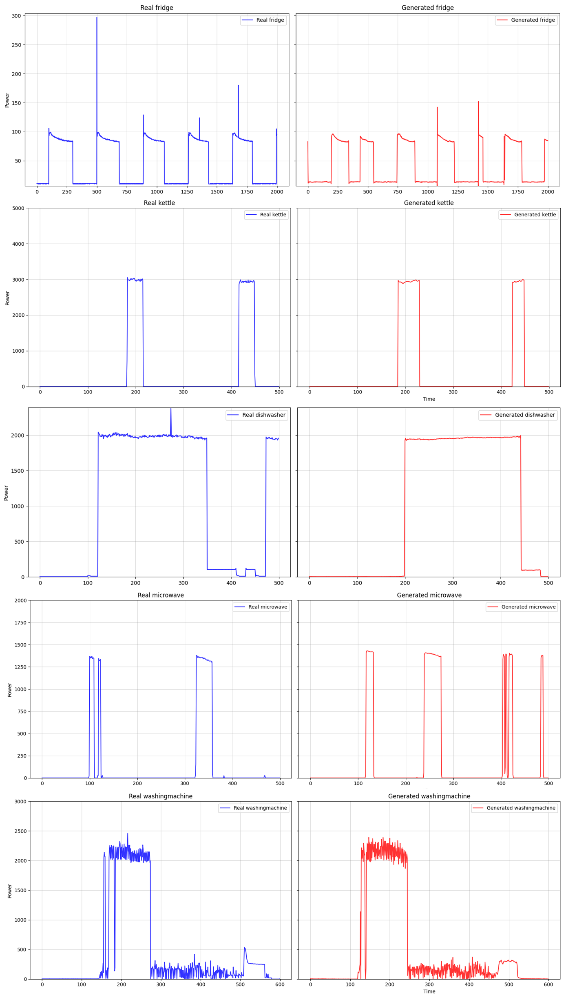

In this repository, there is code available to implement our proposed framework for improving NILM robustness based on the Diffusion model.

Our work uses Diffusion model to synthesize high-usage robust electrical load data, mix it with the original data to improve the robustness of the model, and use synthetic data to fill in the gaps when the data set is insufficient.

## Requirements:

The code requires conda3 and one CUDA capable GPU，The version of python should preferably be greater than 3.7 our environment(for reference only): tensorflow==2.3.0 pytorch==2.1.1 keras==2.4.0 scikit-learn==1.1.2 

## Dataset Preparation for UK_DALE

We use the UK_Dale low-frequency dataset(1/6Hz).UK_DALE datasets are available in (https://data.ukedc.rl.ac.uk/cgi-bin/data_browser/browse/edc/efficiency/residential/EnergyConsumption/Domestic/).

## Start electrical load data synthesis

After selecting the effective part of the electrical appliance data to be trained, you can start using the Diffusion model for load synthesis and execute the main.py file to perform load data synthesis.

Diffusion model training:

```
python main.py --name 'applianceName' --config 'applianceName.yaml' --gpu 0 --train
```

Diffusion model load synthesis:

```
python main.py --name 'applianceName' --config 'applianceName.yaml' --gpu 0 --sample 0 --milestone 'checkpoint'
```

We used LoadSynthesisExample.ipynb to perform a synthesis example.

After obtaining the synthesized load data, you can run InverseTransform.py to perform inverse normalization to obtain the complete power load data.

## Start the NILM testing

Put the original UK_DALE data into the folder directory dataset_preprocess and name it UK_DALE. Run uk_dale_processing.py to perform Z-Score standardization to obtain the prepared NILM original training and test datasets. We use house 2 for training and testing, and house 1 for cross-house testing.

When using the framework for NILM data augmentation, the synthetic data must first be normalized with the same Z-Score as the original data before being mixed for NILM model training.

After preprocessing all datasets, you can run NILM-main/EasyS2S_test.py to verify the results in our paper. We provide the baseline models of 5 appliances and the enhanced models ('*.h5' files), which are stored in the file directory 'NILM-main/models'


## Visualization



## Acknowledgement

We appreciate the following github repos a lot for their valuable code base:

https://github.com/linfengYang/AugLPN_NILM   
https://github.com/Y-debug-sys/Diffusion-TS  
https://github.com/LeapLabTHU/Agent-Attention  
https://github.com/MingjunZhong/NeuralNetNilm  
https://github.com/MingjunZhong/transferNILM/  

C. Zhang, M. Zhong, Z. Wang, N. Goddard, and C. Sutton. Sequence-to-point learning with neural networks for non-intrusive load monitoring. In Proceedings for Thirty-Second AAAI Conference on Artificial Intelligence. AAAI Press, 2018.

------

Contact e-mail:miles_gzy@163.com
